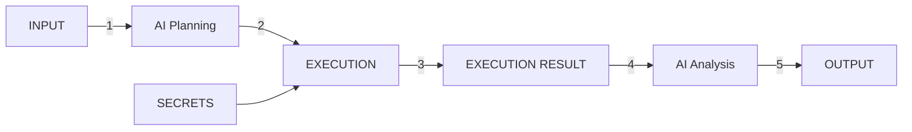

# RAS Testing Workspace

This workspace contains shared tooling and project-specific test cases for NIH RAS integration testing.

The main shared component is the step-based workflow runner in [ras-workflows](ras-workflows). It is designed to execute reusable RAS workflow steps in a caller-defined order, using shared configuration and audit logging. The runner is intentionally not tied to only CTDC or only C3DC. It can be reused by both projects.

## Skills Used In This Process

This workflow uses two companion skills:

- **ras-test-executer**: reads Excel-defined test cases, maps natural language steps to workflow step IDs, and runs the shared workflow runner.
- **ras-test-validator**: validates generated execution artifacts against expected pass/fail criteria and produces validation reports.

Together, these skills provide an execute-then-validate loop for RAS OAuth test coverage.

## General System Design



Brief flow:

- Input test definitions are planned into executable workflow steps.
- Execution uses runtime secrets and environment settings.
- Execution results are analyzed and transformed into final output artifacts.

## What It Is

The shared runner lets you:

- define a workflow as an ordered array of step IDs;
- supply system-level settings and user-level settings as file URLs or file paths;
- execute reusable RAS actions such as authorization, token exchange, userinfo, passport parsing, visa validation, DRS access, refresh, and logout;
- export audit logs for every run using the supplied test-case name;
- generate a static HTML dashboard that summarizes test results and provides per-test step, evidence, and screenshot details.

## Workspace Layout

- [ras-workflows](ras-workflows) - shared step runner and logging utilities
- [lib](lib) - shared helper functions used by the runner and tests
- [Docs](Docs) - source workflow and endpoint documentation
- [generate-dashboard.mjs](generate-dashboard.mjs) - static test-results dashboard generator

## How To Use It

### 1. Install dependencies

From the workspace root:

```sh
npm install
```

### 2. Run the shared workflow runner

From the workspace root:

```sh
npm run workflow:run -- \
  --steps 2,3,4 \
  --system-settings file:///absolute/path/to/system.env \
  --user-settings file:///absolute/path/to/user.env \
  --test-case Example-Run
```

### 3. Choose step IDs

The current step map is:

- `1` authorize/login through RAS (supports id.me or login.gov via IDP env var; captures screenshot at each step)
- `2` exchange authorization code for tokens
- `3` call userinfo
- `4` decode Passport and Visas
- `5` validate Visas
- `6` request DRS access
- `7` verify signed URL
- `8` refresh access token
- `9` revoke access token
- `10` logout session
- `11` export context snapshot

### 4. Use project-specific wrappers when needed

CTDC can call the shared runner through its local wrapper script, but the actual runner lives at the workspace root. That keeps the workflow reusable instead of project-specific.

### 5. Generate the test-results dashboard

After executing and validating test cases, generate the dashboard from the workspace root:

```sh
npm run dashboard:generate
```

You can also run the generator directly:

```sh
node generate-dashboard.mjs
```

The generator recursively scans `test-results/`. It prefers validation reports named `*-validation-report.json` and uses raw JSON files under `workflow-logs/` as a fallback when a validation report is unavailable. No additional dashboard dependencies are required.

By default the dashboard includes every test-results run it finds. To scope generation to a single run:

```sh
node generate-dashboard.mjs --run 2026-07-16T14-51-03-574Z
node generate-dashboard.mjs --latest        # most recent run folder only
```

The generated index page also has a "Run" dropdown (shown whenever more than one run is included) to interactively filter the table by run folder in the browser, without regenerating.

Each run writes into its own timestamped subfolder under `test-results/dashboard/`, so previous dashboard runs are preserved instead of being overwritten. The command output prints the exact path to open, for example:

```sh
open test-results/dashboard/2026-07-21T13-44-27-088Z/index.html
```

The dashboard includes overall pass/fail counts and execution timing, links to individual test-case detail pages, step results and validation evidence, links to execution logs, and captured screenshots with an expanded preview.

## Output

Each run writes audit artifacts under:

- `test-results/workflow-logs/*.json`
- `test-results/workflow-logs/*.log`

The file name includes the test-case name and a timestamp.

Dashboard generation writes, per run, into a new timestamped subfolder:

- `test-results/dashboard/<run-timestamp>/index.html` - high-level test summary
- `test-results/dashboard/<run-timestamp>/details/*.html` - individual test-case details

Screenshots remain in their original artifact directories and are referenced by the generated pages, so keep the dashboard inside `test-results/` if you move or archive the results. Older timestamped dashboard runs are never rescanned as test data and are safe to delete manually once no longer needed.

## Notes

- Settings files may be `.env`-style text files or JSON objects.
- The runner merges system settings and user settings into one runtime context.
- Step 1 supports multiple identity providers: set `IDP=id.me` or `IDP=login.gov` in your user settings to select which provider to use.
- The workflow should be used for ordered step execution, not for replacing the existing case-based tests under `CTDC/tests` or `C3DC` test cases.
# RAS-TESTING
